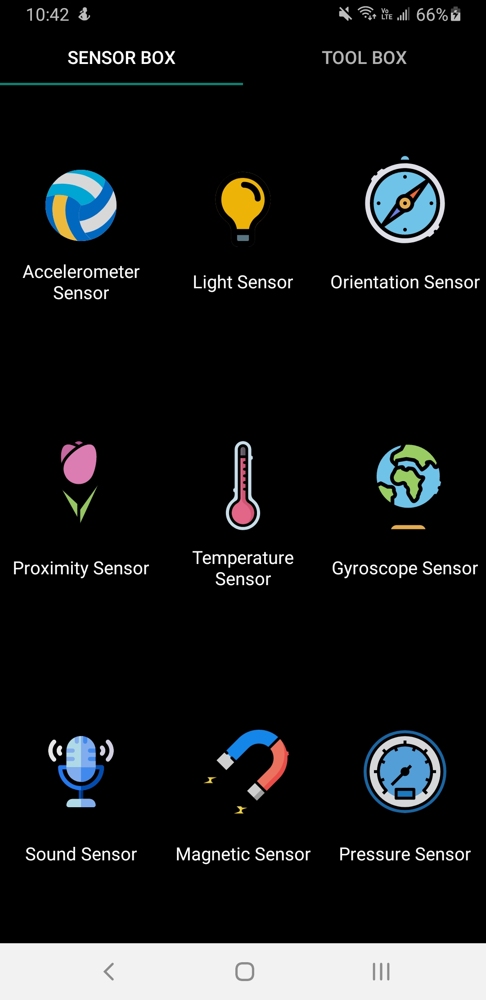
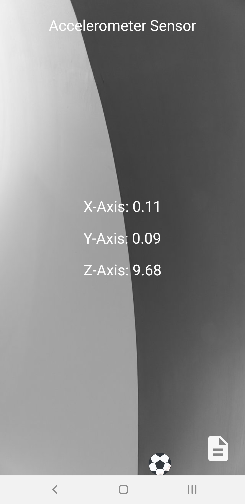

# SensorBox
## Es una aplicacion que te permite visualizar los sensores que tiene tu telefono

### Esta es una imagen de la pantalla principal

| Nombre de sensor                 | Definición                      |
|----------------------------------|---------------------------------|
| Accelerometer Sensor             | Esta se aplica para detectar la direcion del del dispositivo |
| Light Sensor                     | Se aplica para detectar la intensidad de la luz del ambiente actual, despues ajusta la luz de la pantalla acordemente |
| Orientation Sensor               | Se usa para detectar el status de la direction de tu dispositivo |
| Proximity Sensor                 | Mide la distancia entre dos objectos (como la pantalla de tu mano) |
| Temperature Sensor               | Mide la temperatura del ambiente alrededor del dispositivo |
| Gyroscope Sensor                 | Mide 6 direcciones al momento y se ven inmediatamente los resultados |
| Sound Sensor                     | Detecta y mide el sonido al rededor del dispositivo |
| Magnetic Sensor                  | Mide el magnetismo alrededor del telefono |
| Pressure Sensor                  | Mide la presion ambiental alrededor del telefono |

### Screenshot de accelerometer Sensor

